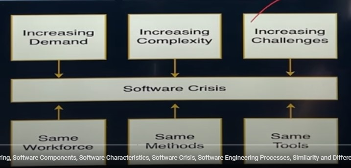
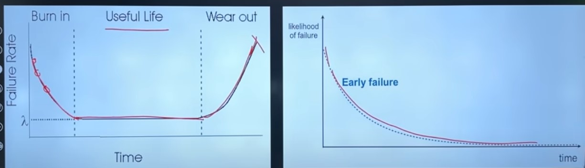
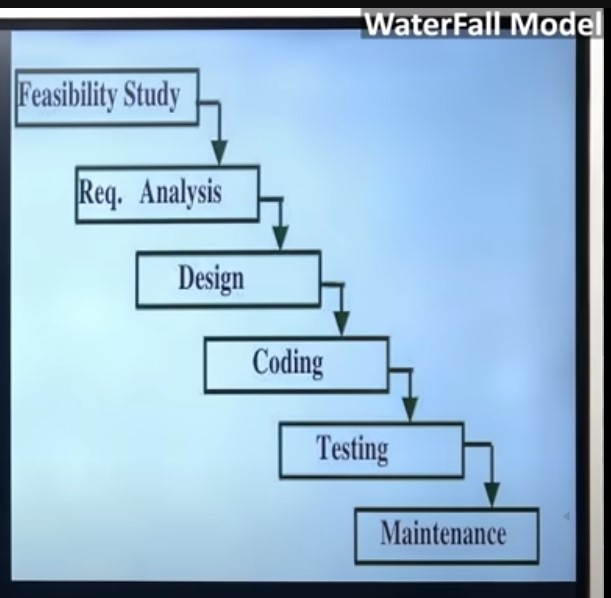
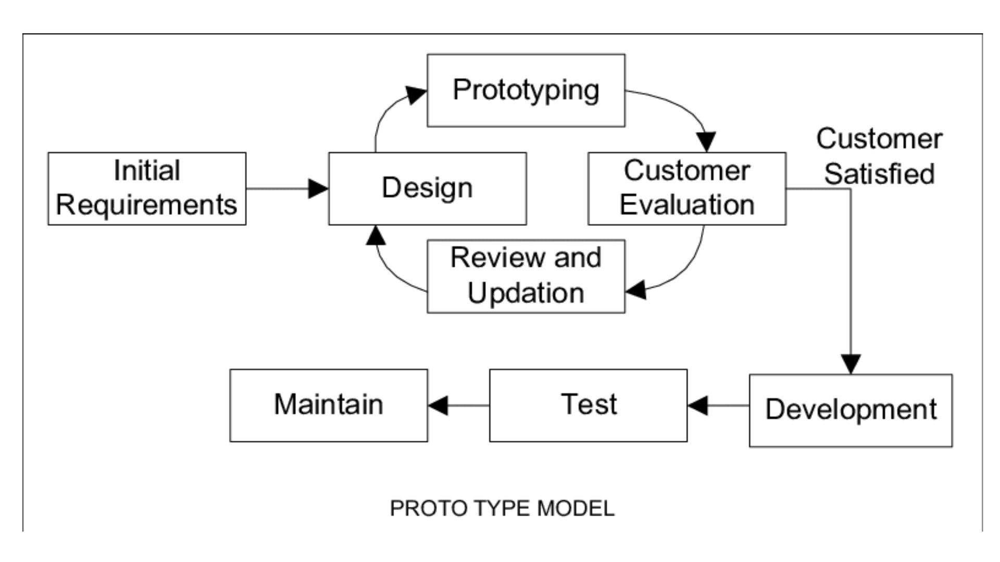
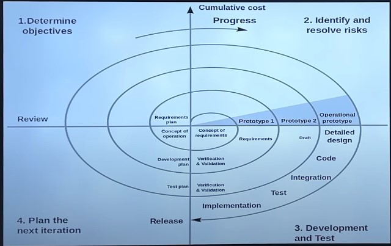

# CHAPTER #01: INTRODUCTION

---

- `Program`: A step by step instruction to perform a specific task on a computer in programming language is called program, i.e. set of instructions.
- `Software`: Is a program along with proper documentation (requirement analysis, design, coding, testing) and user manuals which mainly includes installation guide and other manuals.

### `Software = Program + Documentation`

## **Software Components**:
  A program is a subset of software and it becomes software only if documentation and an operating procedure manual are prepared.
  - `Program`
  - `Documents`

    - Software documentation consists of all the description, programs, graphics and instructions pertaining to design, coding, testing and preparation of software.
    - Operating Procedure (User Manual & Operational Manual)
    - Provides information about what software is, how to work with it, how to install it on your system and how to control all the activities of the software.

## **Software Crisis**:
  - **Problems with software?**
    - The major problem with current scenario in software industry is, software usually overrun their development cost, they exceed their development duration limits, are usually of poor quality.
    - As long as there were no machines, programming was no problem at all; when we had a few weak computers, programming become a mild problem, and now we have gigantic computers, programming has become an equally gigantic problem.

  

## **What is Software Engineering?**
  - In software industry we understand that there is an urgent need to use proper strategies, process and development cycles so that we can produce, or we can design quality products that are within budget, within time and must satisfy the requirement of their users.
  - Software Engineering is the systematic application of engineering principles and methods to the design, development, testing, and maintenance of software products. It involves the use of various tools, techniques, and methodologies to manage the software development process and ensure the quality, reliability, and maintainability of software products.

## **Characteristics of Software**:
  1. **Software Development vs. Manufacturing**:
     1. Software is crafted through a process of coding and development.
     2. Unlike physical products, it isn't produced in factories through a manufacturing process.
  2. **No Physical Wear and Tear**:
     1. Software doesn't deteriorate over time like physical objects.
     2. Its performance doesn't degrade due to physical use.
  3. **Custom-Built Nature**:
     1. Most software is specially designed to meet specific needs.
     2. It's often not just a combination of pre-existing components but requires unique coding and design.
  4. **Intangibility of Software**:
     1. Software can't be touched or handled physically.
     2. It exists as and functions within computers or digital devices.

## **Major Problems in Software Development**:
  ### Inadequate Requirements Gathering
    - Ambiguous or incomplete requirements (client requirements change over time or are incomplete)
    - Lack of communication between stakeholders
  ### Poor Project Management:
    - Inadequate planning, monitoring, and control
    - Lack of risk assessment and mitigation
    - Multiplicity of software development life cycle
    - Selection of wrong technology or tool for development
  ### Insufficient Time and Budget:
    - Unrealistic deadlines and resource constraints
    - Inefficient resource allocation and prioritization
  ### Lack of Skilled Personnel:
    - Inadequate expertise in the development team
    - High turnover rates and loss of experienced staff (developers lacking technical skills or grip on technologies)
  ### Resistance to Change:
    - Difficulty in adapting to new technologies or processes
    - Reluctance to modify established practices or mindsets
    - Rapid technology advancement (not adopting changes over time or not updating the software codebase)

## **Similarity and Differences from Conventional Engineering Process**
   **Nature of the Product**:
    - `Similarity`: Both processes aim to create high-quality, reliable products.
    - `Difference`: Conventional engineering focuses on physical systems, while software engineering deals with intangible software systems.
  - **Design Flexibility and Iteration**:
    - `Similarity`: Both processes involve iterative design and prototyping.
    - `Difference`: Software engineering allows for greater flexibility and ease of modification due to the non-physical nature of software.
  - **Quality Assurance and Testing**:
    - `Similarity`: Both processes emphasize the importance of testing and quality assurance to ensure product performance and reliability.
    - `Difference`: Conventional engineering often involves physical testing of prototypes, while software engineering relies on various types of software testing, such as unit, integration, and system testing.
  - **Project Management and Collaboration**:
    - `Similarity`: Both processes require effective project management, team collaboration, and communication among stakeholders.
    - `Difference`: Software engineering projects may involve distributed teams and rely more heavily on digital communication and collaboration tools.
  - **Maintenance and Evolution**:
    - `Similarity`: Both processes involve maintenance and support activities to ensure the ongoing performance and reliability of the product.
    - `Difference`: Software engineering typically demands more frequent updates, patches, and evolution due to the rapidly changing nature of technology and user requirements.
  - For hardware, the same production cost every time; for software, production cost only for the first time and then only maintenance cost. The life cycle of the hardware follows the bathtub curve, while in the life cycle of the software, failure intensity goes down with time.

  

## **Software Quality Attributes**:
  - **Correctness**: The ability of the software to perform its intended tasks effectively and meet user requirements.
  - **Usability**: The ease with which users can learn, operate, and navigate the software.
  - **Reliability**: The software's consistency in producing accurate results and maintaining performance over time.
  - **Efficiency**: The optimal use of system resources, such as memory and processing power, to achieve desired outcomes.
  - **Maintainability**: The ease of updating, modifying, and fixing the software to accommodate changing requirements or fix issues.
  - **Portability**: The ability of the software to operate on different platforms or environments without significant modifications.
  - **Scalability**: The software's capacity to handle increased workloads or user demands without compromising performance.
  - **Security**: The software's ability to protect against unauthorized access, data breaches, and other potential threats.
  - **Modularity**: The degree to which the software's components are organized into separate, manageable units that can be independently developed or updated.
  - **Reusability**: The potential for the software's components to be used in other applications or contexts, reducing development time and costs.
  - **Testability**: The ease with which the software can be tested to ensure it meets its requirements and performs as expected.

## **Software Process**:
  A software process (also known as software methodology) is a set of related activities that leads to the production of the software. These activities may involve the development of the software from scratch, or modifying an existing system.

  ### **Feasibility Study**:
    - Find abstract definition of the problem
    - Majorly checking the financial and technical feasibility
    - Analysis of cost and benefit ratio
    - Checking availability of infrastructure and human resource
    - Examination of alternative solution strategies

  ### **Requirement analysis and specification**:
  - Try to understand the exact and complete requirement of the customer and document them properly.
  - Try to collect and analyze all data related to the project
  - In the end, a large document will be written in the natural language which will describe what the system will do without describing how, called SRS (Software Requirement Specification)
  - Very critical phase because a small error here can result in severe problems in later stages

  ### **Designing**:
  - We transform the requirements into a structure that is suitable for implementation of the code in a specific programming language.
  - Overall architecture and the algorithmic strategy are chosen (Coupling and cohesion)
  - Lastly, we will prepare a document called SDD (Software Design Description), which will describe how the system will perform functionality

  ### **Coding**:
  - The goal of coding is to translate the design of the system into a code of programming language
  - It affects both testing and maintenance, so it is also a critical feature
  - We will be discussing some guidelines for how to write maintainable and readable code.

  ### **Testing**:
  - Because of human errors, there will be a bug or fault in the code and if that bug/fault is executed it becomes a failure.
  - Software testing is a process of executing a program with the intention of finding bugs or faults in the code.

  ### **Implementation**:
  - Software is installed on the user site and training of the user and hardware requirement check is done

  ### **Maintenance**:
  - Any change made in the software after its official release is called maintenance. It could be because of various reasons:
    - Adaptive
    - Corrective
    - Perfective

## **Software Development Life Cycle (SDLC)**:
  - Software development organizations follow some process when developing a software product; in mature organizations, this is well defined and managed.
  - In SDLC, we develop software in a systematic and disciplined manner. SDLC will define entry and exit for every stage. It makes assessment possible, time prediction, cost prediction, scheduling, and identifying faults early possible.
  - Selection of a correct development model plays an important role in cost, quality, and overall success of the project.
    ### **Waterfall Model**:
      - Developed in the 1970s by Winston W. Royce.
      - Inspired by manufacturing and construction processes, where each step relies on the completion of the previous one.
      - It is the simplest SDLC in which phases are organized in linear sequential order.
      - It is called the waterfall model as its diagrammatic representation resembles a waterfall, also known as the classical life cycle model.
      
      - This type of model is basically used for small to medium-sized projects with clear, well-defined requirements. When the technology and tools to be used are well-known and stable.
      - Projects where minimal changes are expected during the development process, and predictability is prioritized over adaptability.
        - **Advantages**:
          - Easy to understand and implement, with well-defined stages and clear milestones.
          - Each phase has well-defined input and output, phases are processed and completed one at a time. Phases don't overlap.
          - Low cost and easy to schedule, as all staff don't work concurrently on the same project, so they can work on different projects.
        - **Disadvantages**:
          - Not suitable to accommodate any change or iteration once development has begun. It is always difficult to acquire all the requirements in the starting.
          - Working version is produced in the last level, so not good for large size sophisticated projects.
          - High amounts of risk and uncertainty.
    ### **Prototype Model**:
      The Prototype Model is a software development approach where a working prototype of the software is created early in the development cycle. This prototype is an incomplete version of the software but demonstrates its key functionalities. It is then reviewed by stakeholders, and based on their feedback, the prototype is refined iteratively until it meets their expectations.
      
      - **Phases of the Prototype Model**:
        1. `Requirement Gathering`: Initial requirements are collected from users.
        2. `Quick Design`: A preliminary design is created with essential features.
        3. `Prototype Development`: A working prototype is built.
        4. `User Evaluation`: Users test and provide feedback on the prototype.
        5. `Refinement`: The prototype is improved based on feedback.
        6. `Final Product Development`: After user satisfaction, the actual system is developed, tested, and deployed.
      - **Advantages**:
        - Early visualization helps users understand the software.
        - Reduces misunderstandings in requirements.
        - Provides continuous user feedback.
        - Identifies missing functionalities early.
      - **Disadvantages**:
        - Increases development cost and time due to multiple iterations.
        - May lead to scope creep if users keep requesting changes.
        - Poorly designed prototypes might mislead developers.
    ### **Spiral Model**:
      The Spiral Model is a risk-driven software development methodology that combines iterative development with systematic risk analysis. It is best suited for complex and high-risk projects.
      
      - **Phases of the Spiral Model**:
        1. `Planning`: Requirements are gathered, and objectives are set.
        2. `Risk Analysis`: Risks are identified, and solutions are proposed.
        3. `Engineering`: Development and testing of the software.
        4. `Evaluation`: The system is reviewed, and feedback is incorporated.
        5. `Repeat`: The process continues in a spiral manner until the final product is complete.
      - **Advantages**:
        - Strong risk management approach.
        - Works well for large and complex projects.
        - Continuous user feedback ensures better end-product quality.
        - Changes can be easily incorporated during development.
      - **Disadvantages**:
        - Requires highly skilled personnel for risk analysis.
        - Can be expensive due to repeated iterations.
        - Not suitable for small or low-risk projects.
    ### **Incremental Development Model**:
      The Incremental Model develops software in small, functional increments. Each increment adds new features while ensuring earlier versions remain operational.
      
      - **Phases of the Incremental Development Model**:
        1. `Requirement Analysis`: System divided into smaller modules.
        2. `Design & Development`: Each module is developed independently.
        3. `Testing`: Modules are tested individually and integrated.
        4. `Deployment & Maintenance`: Final integration and updates.
      - **Advantages**:
        - Early functional deliveries.
        - Easier debugging and testing.
        - Flexible and scalable.
        - Reduces project risk with continuous feedback.
      - **Disadvantages**:
        - Requires careful planning.
        - Integration challenges.
        -  More effort needed for multiple cycles.