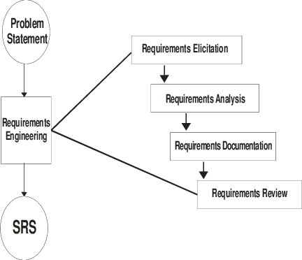
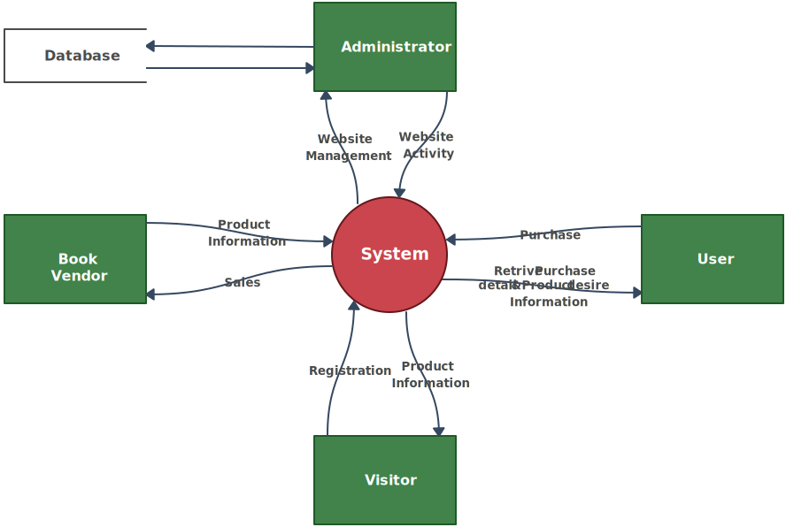
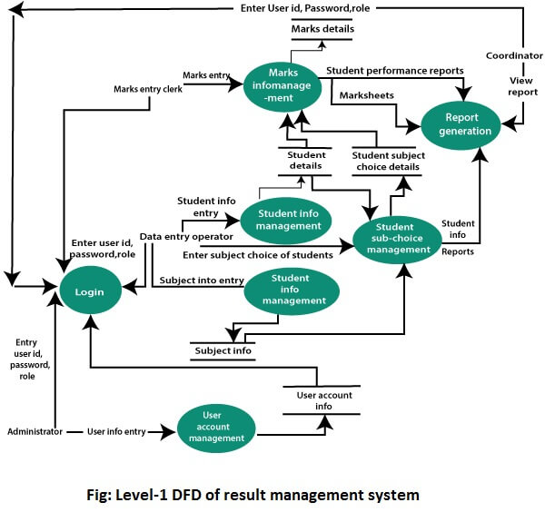
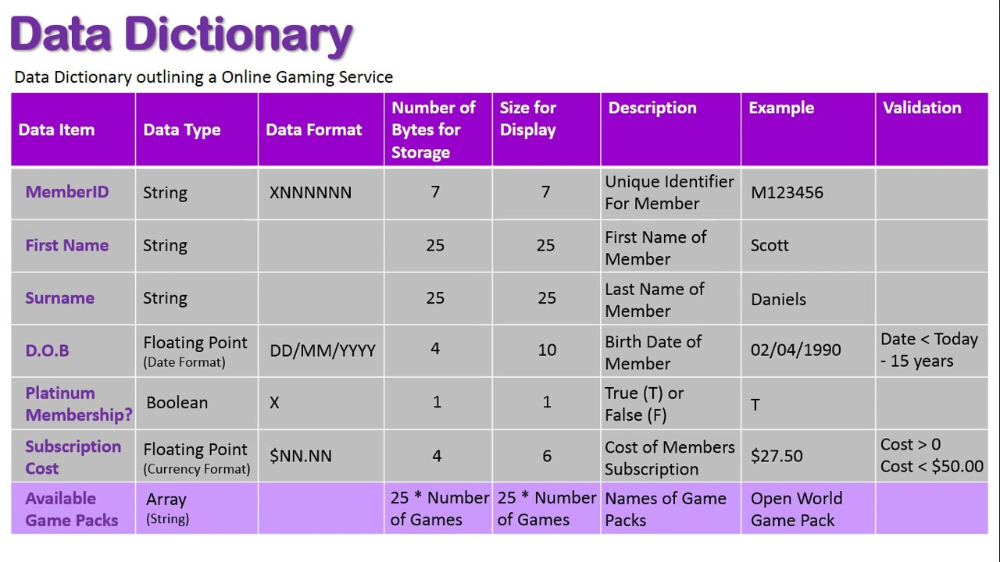
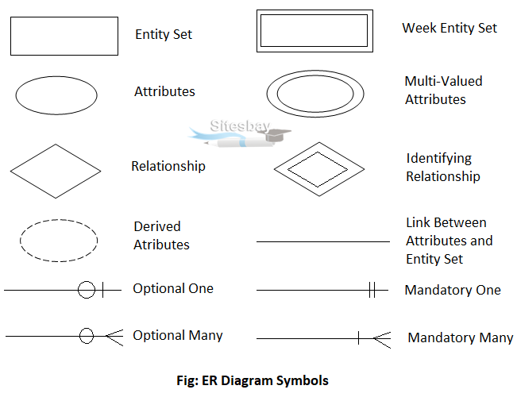
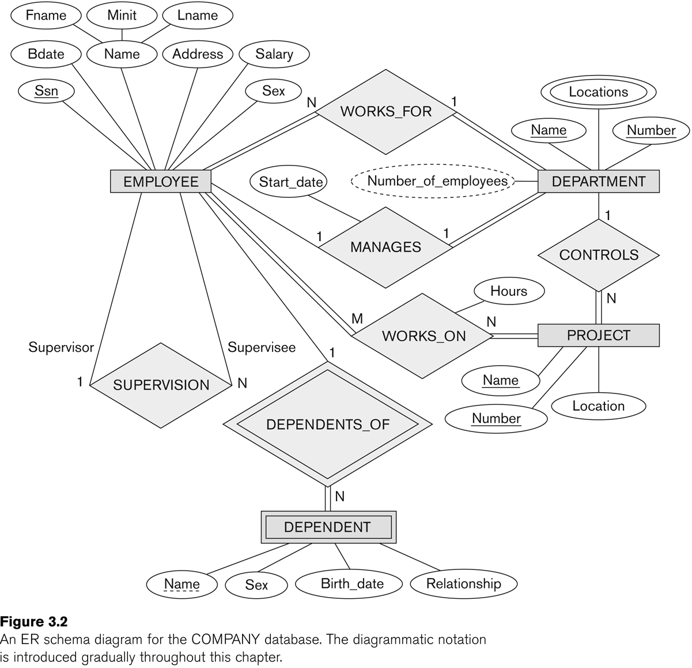
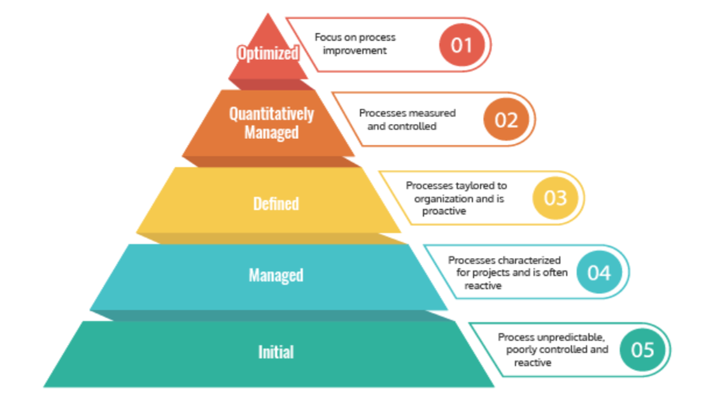

# CHAPTER #02: SOFTWARE REQUIREMENT & SPECIFICATIONS

---

## Requirement Engineering Process
The hardest part of building a software is deciding precisely what is to be built. Requirement engineering is the disciplined application of proven principle, methods, tools and notations to describe a proposed system's intended behaviour and its associated constraints.

**Difficulties of Requirement Engineering**
- `Requirement are difficult to uncover`: no one give the complete requirement in the first time, if someone does then also requirement are incomplete.
- `Requirement Changes`: with the development process requirements get added and changed as the user begins to understand the system and his or her real need.
- `Tight Project Schedule`: have insufficient time to do a decent job.
- `Communication Barrier`: user and developer have different technical background and tastes.
- `Lack of resources`: there may not be enough resources to build software that can do everything the customer wants.

**Type of Requirement**
- `Known requirement`: Which is already known to stake holder
- `Unknown requirement`: Forgotten by stake holder because that are not needed right now.
- `Undreament requirement`: StakeHolder is unable to think of new requirement due to limited domain knowledge.

*There are majorly four steps in requirement analysis·*
- `Requirement Elicitation`: Gathering of Requirement.
- `Requirement Analysis`: Requirements are analysed to identify inconsistences, defects etc and to resolve conflicts.
- `Requirement documentation`: Here we document all the refined requirement properly.
- `Requirement Review`: Review is carried out to improve the quality of the SRS.

### Elicitation

**Methods of requirement elicitation**
Is the most difficult, most critical, most error-prone and communication intensive aspect of the s/w development. It can only succeed only through an effective customer developer partnership.

 **Interview**
- Both parties would like to understand each other
Interview can be of two types open-ended or structured
- In open ended, there is no present agenda, context free questions can be asked to understand the problem, to have an over view over the situation 
- In structured interview, agenda is pre-set.

**Brain Storming**
-  A kind of group discussion, which lead to ideas very quickly and help to promote creative thinking.
- Very popular now a days and is being used in most of the organizations.
- All participants are encouraged to say whatever idea come to their mind and no one will be criticized for any idea no matter how goofy it seems.

**Delphi technique**
Here participants are made to write the requirement on a piece of paper, then these requirements are exchanged among participants who gave their comments to get a revised set of requirements. This process is repeated till the final consensus is reached

**FAST (facilitated application specification technique)**
- This approach encourages the creation of joint team of customer and developer who works together to understand correct set of requirements
-  Everyone is asked to prepare a list of 
    - What surrounds the system.
    - Produced by the system.
    - Used by the system.
    - List of service, constraints, and performance criterion.
    - Then we divide these lists into smaller list to work in smaller teams.

**QFD (quality functional deployment):**
-  Its emphases to incorporate the voice of the customer with importance
-  Then according to customer, a value indicating a degree of importance, is assigned to each requirement. Thus, the customer, determine the importance of each requirement on a scale of 1 to 5 as:
    - `5 points`: very important 4 points: important
    - `3 points`: not important but nice to have
    - `2 point`: not important 1 point: unrealistic, requires

**Use case approach**
- These are structured description of the user requirement. It is a narrative which describe the sequence of events from user's perspective.
- Use case diagrams are graphical representation to show the system at different levels.
- They are some times supportive my the activity diagrams, to understand the work flow.

## Data Flow Daigram

**Requirement analysis**
- In this phase we analysis all the set of requirements to find any inconsistency or conflicts.
- In requirement gathering phase our all concentration was on getting all the set of requirements but now, we see how many requirements are contradictory to each other or requires further exploration to be considered further.
- Different tools can be used Data flow diagram, Control flow diagram, ER diagram etc

**Data Flow Diagram**
A data flow diagram or bubble chart is a graphical representation of the flow of data through a system. It clarifies systems requirements and identify major transformations.
DFD represent a system at different level of abstraction. DFD may be Partitioned into levels that represent increasing information flow and functional details.

`Components of DFD(Data Flow Daigram):`
- Function/Process
- Data Store
- External Entity
- Data Flow

DFD uses hierarchy to maintain transparency thus multilevel DFD's can be created. Levels of DFD are as follows:

- `O-level DFD`: It represents the entire system as a single bubble and provides an overall picture of the system.

- `1-level DFD`: It represents the main functions of the system and how they interact with each other.

- `2-level DFD`: It represnts the processes within each function of the system and how they interact with each other.

## Control Flow Daigram 

**Control Flow Daigram/ Control Flow Chart/ Flow Chart**
A flow chart is graphical representation of how to control flow during the execution of the program. It use the following symbols to represent a system's control flow.

## Data Dictionary
- `Purpose:` Serves as a repository for data item details in Data Flow Diagrams, ensuring consistent definitions between customers and developers.
- `Content:` Includes data item name, aliases, and purpose, promoting clearunderstanding.
- `Relationships & Range:` Records data item relationships and value ranges (e.g., marks between 0-100).
- `Data Flows & Structures:` Tracks process interactions with data items anddocuments their structure or composition.
- `Role in Requirements:` Essential in initial stages for defining customer data items, aligning developer and customer understanding.

## Entity Relational Daigram (ER Daigram)
- ER Diagram a non-technical design method works on conceptual level based on the perception of the real world.
- E-R data model was developed to facilitate software designers by allowing specification of an enterprise schema that represents the overall logical structure of a database.
- Three main constructs are data entities, their relationships and their associated attributes.

### `Example:`

## Decision Tables
- A decision table is a brief visual representation for specifying which actions to perform depending on given conditions.
- A decision table is a good way to settle with different combination inputs with their corresponding outputs.
- Decision tables are very much helpful in requirements management and test design techniques. It provides a regular way of starting complex business rules, that is helpful for developers as well as for testers.

### **Decision Table vs. Decision Tree in ER Diagrams**
| Feature          | Decision Table | Decision Tree |
|-----------------|---------------|--------------|
| **Structure**   | Tabular format | Hierarchical (Tree) |
| **Visualization** | Less intuitive | More intuitive |
| **Complexity Handling** | Better for complex rules | Suitable for simple to moderate rules |
| **Redundancy** | Avoids redundancy | May have redundancy |
| **Best Used For** | Rule-based systems, validation | Decision-making processes, AI models |

#### **Relation to ER Diagrams**
- **Decision Tables**: Not typically represented in an ER diagram but can be modeled as an entity storing rules.
- **Decision Trees**: Can be represented in an ER diagram by entities like `Decision`, `Condition`, and `Outcome` with relationships.

## Documentation 
- After have final set of requirements it is also necessary to document them properly in a standard format, so that can be understood easily even by non- technical person.
- Here IEEE provides standard for SRS documents in IEEE830, using which we can make SRS document more readable, modifiable, and a format which can be followed through the world.
### `IEEE Standard for SRS`
1. **Introduction**
    - Purpose
    - Scope/Intended Audience
    - Definition, Acronyms and Abbreviation
    - References / Contact Information / SRS team member
    - Overview
2. **Overall Description**
    - Product Perspective
    - Product Functions
    - User Characteristics
    - General Constraints
    - Assumptions and dependencies
3. **Specific Requirement**
    - External interface requirements(user/hardware/software interface) 3.2-Functional requirements
    - Performance requirements
    - Design constraints(Standards compliance/hardware limitations)
    - Logical database requirements
    - Software system attributes(Reliability, availability, Security, Maintainability)
4. **Change Management Process**
5. **Document Approvel**
    - Table, Daigrams and flowchart
    - Appendices
    - Index

## Requirement Review
Before finalising the requirement one more review specially by a third party, who a master in the industry is advisable, to have a fresh look over the system, and can mentions any points if missed by team.

## Software Quality Assurance (SQA)
- `Definition:` SQA is a process ensuring software products meet quality standard and requirements.
- `Objective:` Prevent defects, improve quality, and ensure customer satisfaction.
- `Process:` Implements quality control and management activities throughout development.
- `Techniques:` Uses code reviews, inspections, audits, and testing to evaluate software quality.
- `Standards:` Adheres to international standards like ISO 9001, IEEE 730, and CMMI.
- `Quality Attributes:` Focuses on reliability, maintainability, usability, efficiency, and functionality.
- `Continuous Improvement:` Monitors processes and products to identify and implement improvements.
- `Metrics:` Employs metrics like defect density and code coverage to evaluate quality.
- `Training:` Emphasizes skill development for developers and testers to meet quality standards.
- `Documentation:` Requires proper documentation for transparency and traceability.

**Validation/Black Box**
- Validation ensures that the software product meets the end-user requirements and is fit for its intended purpose, "Are we Building the right product". Ensures that the product meets its design specifications.
- Focuses on static analysis techniques. Checks for consistency, completeness, and correctness.
    - Code reviews.
    - Static analysis tools.
- Inspection of requirements, design, and code documentation.

**Verification/White Box**
- Verification ensures that the software product is designed and developed according to the specified requirements and standards. "Are we building the product right".
- Process of Ensuring that the product meets its design specifications.
- Focuses on static analysis techniques. Checks for consistency, completeness, and correctness.
    - Code reviews.
    - Static analysis tools.
- Inspection of requirements, design, and code documentation.

## Software Quality Factors
- The various factors, which influence the software, are termed as software factors. They can be broadly divided into two categories.
    - The first category of the factors is of those that can be measured directly such as the number of logical errors.
    - Second category clubs those factors which can be measured only indirectly. For example, maintainability but each of the factors is to be measured to check for the content and the quality control.

- Several models of software quality factors and their categorization have been suggested over the years. The classic model of software quality factors, suggested by McCall in 1977. The 11 factors are grouped into three categories.
    - `Product operation factors` - Correctness, Reliability, Efficiency, Integrity, Usability.
    - `Product revision factors` - Maintainability, Flexibility, Testability.
    - `Product transition factors` - Portability, Reusability, Interoperability.

**`ISO 9000 Models in Software Engineering`**
ISO 9000 is a series of international standards related to quality management and assurance. In the context of software engineering, these standards provide guidelines for implementing effective processes and ensuring high-quality software products.

**Key Components of ISO 9000**
- Quality Management System (QMS):
    - Defines policies and objectives for quality, Documentation of procedures and processes, Monitoring, measurement, and analysis of processes, Improvement opportunities and corrective actions.
- Management Responsibility:
    - Top management commitment to quality Establishment of a quality policy Ensuring adequate resources for QMS implementation Reviewing QMS performance regularly.
- Resource Management:
    - Provision of necessary resources (human, infrastructure, work environment) Competence and training of personnel Infrastructure maintenance and improvement.
- Product Realization:
    - Requirements determination and communication Product design and development Verification, validation, and testing Release, delivery, and post-delivery support.
- Measurement, Analysis, and Improvement:
    - Monitoring and measurement of processes and products Internal audits to ensure compliance Corrective and preventive actions Continual improvement of the QMS.

1. **ISO 9000 Principles**
    1. Customer focus 2. Leadership
    3. Process approach
    4. Continual improvement
2. **ISO 9001:2015 - Quality Management Systems**
    1. Applicable to any organization size and industry
    2. Focus on customer satisfaction, regulatory compliance, and improvement
    3. Requirements cover context, leadership, planning, support, operation, evaluation, and improvement
3. **ISO/IEC/IEEE 9003:2018 - Software Engineering**
    1. Guidance for applying ISO 9001:2015 to software engineering
    2. Covers software development, supply, acquisition, operation, and maintenance
    3. Addresses both product and process quality aspects
    4. Applicable to various software development methodologies 

**Implementation Steps for ISO 9000 in Software Engineering**
- Obtain top management commitment.
- Establish a quality management system.
- Train and educate employees.
- Document processes, procedures, and policies Monitor, measure, and analyze processes.
- Implement improvements and corrective actions • Conduct internal audits.
- Seek third-party certification (ISO 9001).

## CAPABILITY MATURATY MODEL
- CMM is a strategy for improving the software process, to generate quality software.
- The Capability Maturity Model (CMM) is a development model created after a study of data collected from organizations that contracted with the U.S. Department of Defence, who funded the research. The term "maturity" relates to the degree of formality and optimization of processes, from ad hoc practices, to formally defined steps, to managed result metrics, to active optimization of the processes.
- It is use to judge the maturity of s/w process an organization and to identify the key practise that are required to increase the maturity of theses process. There are five levels of the CMM.

1. **Initial (process unpredictable and poorly controlled)**
- No engineering management, everything done on ad hoc basis.
- Software process is unpredictable with respect to time and cost.
- It depends on current staff, as staff change so does the process.
2. **Repeatable (basic project management)**
- Planning and managing of new projects are based on the experience with the similar projects.
- Realistic plans based on the performance based on the previous projects.
3. **Defined (process standardization)**
- Process of developing and maintaining s/w across the organization is documented including engineering and management.
- Training programs are implemented to ensure that the staff have skills and knowledge required.
- Risk management.
4. **Managed (Quantitative measurement)**
- Organization set quantitative goals for both product and process.
- Here process is predictable both with respect to time and cost.
5. **Optimized (continuous process improvement)**
- Here organization analysis defects to determine their causes and goals is to preventing the occurrence of defects.
- Here company continuously improve the process performance of their projects.