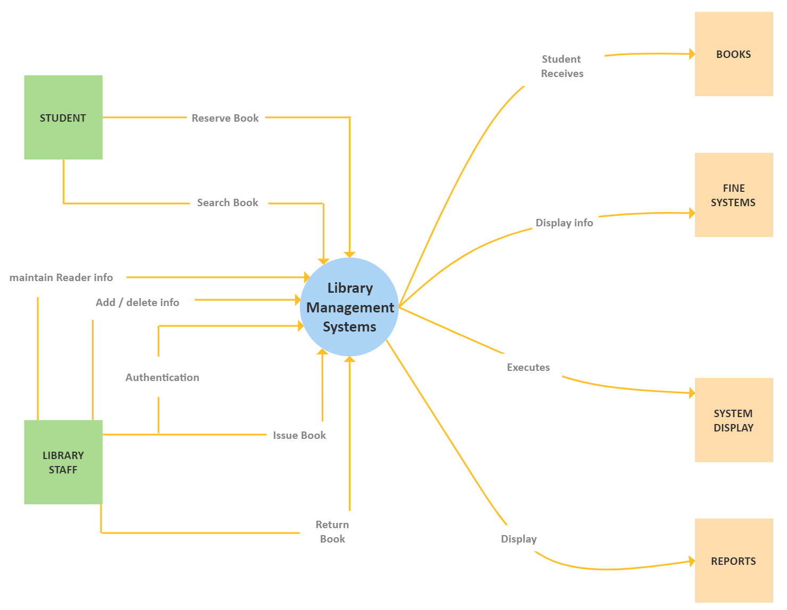

# CHAPTER #01: SOFTWARE REQUIREMENT & SPECIFICATIONS

---

## Requirement Engineering Process
The hardest part of building a software is deciding precisely what is to be built. Requirement engineering is the disciplined application of proven principle, methods, tools and notations to describe a proposed system's intended behaviour and its associated constraints.

**Difficulties of Requirement Engineering**
- `Requirement are difficult to uncover`: no one give the complete requirement in the first time, if someone does then also requirement are incomplete.
- `Requirement Changes`: with the development process requirements get added and changed as the user begins to understand the system and his or her real need.
- `Tight Project Schedule`: have insufficient time to do a decent job.
- `Communication Barrier`: user and developer have different technical background and tastes.
- `Lack of resources`: there may not be enough resources to build software that can do everything the customer wants.

**Type of Requirement**
- `Known requirement`: Which is already known to stake holder
- `Unknown requirement`: Forgotten by stake holder because that are not needed right now.
- `Undreament requirement`: StakeHolder is unable to think of new requirement due to limited domain knowledge.

*There are majorly four steps in requirement analysis·*
- `Requirement Elicitation`: Gathering of Requirement.
- `Requirement Analysis`: Requirements are analysed to identify inconsistences, defects etc and to resolve conflicts.
- `Requirement documentation`: Here we document all the refined requirement properly.
- `Requirement Review`: Review is carried out to improve the quality of the SRS.

### Elicitation

**Methods of requirement elicitation**
Is the most difficult, most critical, most error-prone and communication intensive aspect of the s/w development. It can only succeed only through an effective customer developer partnership.

 **Interview**
- Both parties would like to understand each other
Interview can be of two types open-ended or structured
- In open ended, there is no present agenda, context free questions can be asked to understand the problem, to have an over view over the situation 
- In structured interview, agenda is pre-set.

**Brain Storming**
-  A kind of group discussion, which lead to ideas very quickly and help to promote creative thinking.
- Very popular now a days and is being used in most of the organizations.
- All participants are encouraged to say whatever idea come to their mind and no one will be criticized for any idea no matter how goofy it seems.

**Delphi technique**
Here participants are made to write the requirement on a piece of paper, then these requirements are exchanged among participants who gave their comments to get a revised set of requirements. This process is repeated till the final consensus is reached

**FAST (facilitated application specification technique)**
- This approach encourages the creation of joint team of customer and developer who works together to understand correct set of requirements
-  Everyone is asked to prepare a list of 
    - What surrounds the system.
    - Produced by the system.
    - Used by the system.
    - List of service, constraints, and performance criterion.
    - Then we divide these lists into smaller list to work in smaller teams.

**QFD (quality functional deployment):**
-  Its emphases to incorporate the voice of the customer with importance
-  Then according to customer, a value indicating a degree of importance, is assigned to each requirement. Thus, the customer, determine the importance of each requirement on a scale of 1 to 5 as:
    - `5 points`: very important 4 points: important
    - `3 points`: not important but nice to have
    - `2 point`: not important 1 point: unrealistic, requires

**Use case approach**
- These are structured description of the user requirement. It is a narrative which describe the sequence of events from user's perspective.
- Use case diagrams are graphical representation to show the system at different levels.
- They are some times supportive my the activity diagrams, to understand the work flow.

## Data Flow Daigram

**Requirement analysis**
- In this phase we analysis all the set of requirements to find any inconsistency or conflicts.
- In requirement gathering phase our all concentration was on getting all the set of requirements but now, we see how many requirements are contradictory to each other or requires further exploration to be considered further.
- Different tools can be used Data flow diagram, Control flow diagram, ER diagram etc

**Data Flow Diagram**
A data flow diagram or bubble chart is a graphical representation of the flow of data through a system. It clarifies systems requirements and identify major transformations.
DFD represent a system at different level of abstraction. DFD may be Partitioned into levels that represent increasing information flow and functional details.

`Components of DFD(Data Flow Daigram):`
- Function/Process
- Data Store
- External Entity
- Data Flow

DFD uses hierarchy to maintain transparency thus multilevel DFD's can be created. Levels of DFD are as follows:

- `O-level DFD`: It represents the entire system as a single bubble and provides an overall picture of the system.

- `1-level DFD`: It represents the main functions of the system and how they interact with each other.

- `2-level DFD`: It represnts the processes within each function of the system and how they interact with each other.

## Control Flow Daigram 

**Control Flow Daigram/ Control Flow Chart/ Flow Chart**
A flow chart is graphical representation of how to control flow during the execution of the program. It use the following symbols to represent a system's control flow.

