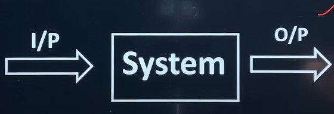
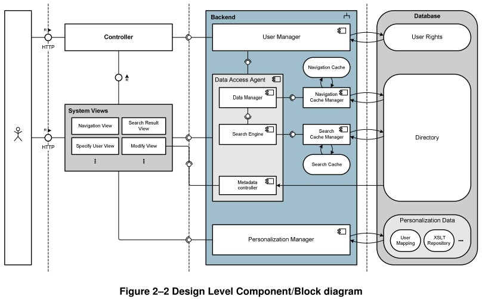
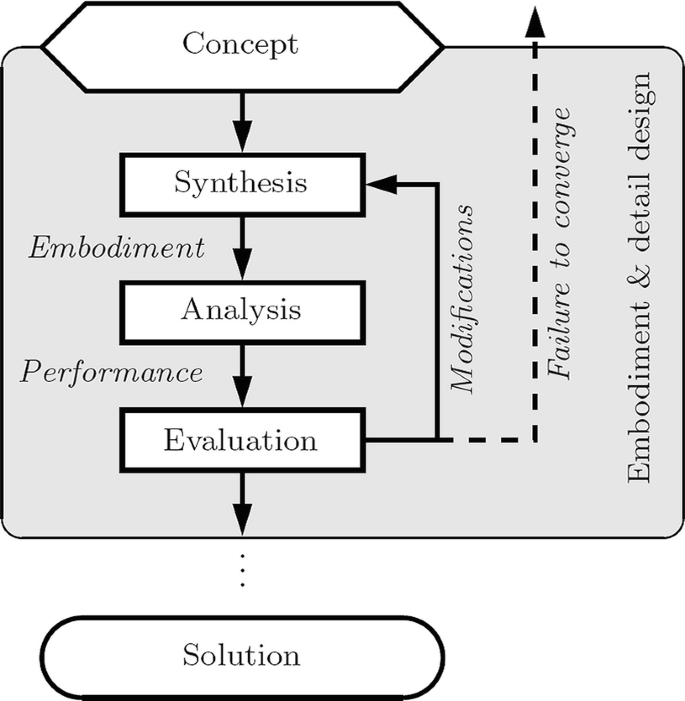

# CHAPTER #03: SOFTWARE DESIGN

---

## Basic Concept of Software Design

**Design**
In software design phase input is SRS document and output is SDD. Software designing is most creative process, where we actually decide how a problem will be solved.

**Characteristics of a Good SDD**
- The SDD must contain all the requirement which were given in SRS.
- The design document must be readable, easy to understand and maintainable.
- It must describe a complete picture of data, functional and behavioural domain.

**Steps of Design**
Software Designing in 3-step process:
1. Interface Design
2. Architectual Design
3. Details Design

### Interface Design
- In this, we treat system as a whole and understand the relationship between the system & environment.
- Here we treat system as a black box and do not concentrate how a function will be implemented but we decide what is input & what should be the output according to user requirement or SRS. **(Like a `black box testing:` "Are we building the right product?")**

### Architectural design
- In this we understand what are the major modules that must be implemented in the system and what are their responsibility and how they will communicate with each other.
- We do not give stress on individual modules but concentrate coupling and cohesion between the modules. Here we treat modules as black box. 



### Detailed design/Low level design
- In this, specification of internal elements of all modules their functions, their processing methods, data structure, algorithms, everything is defined properly.



### Modularity
In modular architecture, we understand that a system is composed of well defined conceptually simple and independent units interacting through a well-defined interface.

**Advantage of having modular architecture**
- Easy to understand and explain.
- It is easy to design and document.
- It is easy to code and test.
- It is easy to maintain.

### Design Structure Charts
Structure Chart represent hierarchical structure of modules. It breaks down the entire system into lowest functional modules, describe functions and sub-functions of each module of a system to a greater detail.
Structure Chart partitions the system into black boxes (functionality of the system is known to the users but inner details are unknown). Inputs are given to the black boxes and appropriate outputs are generated.

**Symbols used in construction of structured chart**
- **`Module:`** It represents the process or task of the system. It is of three types.
    - `Control Module:` A control module branches to more than one sub module.
    - `Sub Module:` Sub Module is a module which is the part (Child) of another module.
    - `Library Module:` Library Module are reusable and invokable from any module.
- **`Condition Call:`** It represents that control module can select any of the sub module the basis of some condition.
- **`Loop (Repetitive call of module):`** It represents the repetitive execution of module by the sub module. A curved arrow represents loop in the module. All the sub modules cover by the loop repeat execution of module.
- **`Data Flow:`** It represents the flow of data between the modules. It is represented by directed arrow with empty circle at the end.
- **`Control Flow:`** It represents the flow of control between the modules. It is represented by directed arrow with filled circle at the end.
- **`Physical Storage:`** Physical storage is that where all the information are to be stored. It is represented by rectangle that have curve edges.

**Benefits of Design Structure Charts in Software Engineering**
- Improved understanding of system architecture
- Simplified communication between team members
- Easier identification of potential issues and dependencies
- Support for modular and maintainable software design

### Pseudocode
Pseudocode is a simplified, informal representation of an algorithm or a program that uses a mix of natural language and programming constructs.
It is used to illustrate the high-level structure and logic of an algorithm without the syntactic details of a specific programming language.
Pseudocode helps developers plan and discuss algorithms, making it easier to understand and translate into actual code later in the software development process.

```
BEGIN
    DISPLAY "Enter first number: "
    READ number1
    DISPLAY "Enter second number: "
    READ number2
    sum ← number1 + number2
    DISPLAY "The sum is: ", sum
END
```

### Coupling and cohesion
Coupling and cohesion are two parameters on which we can understand the quality of modularity in the design of a software
**Coupling:** 
The measure of interdependence of one module over another module

