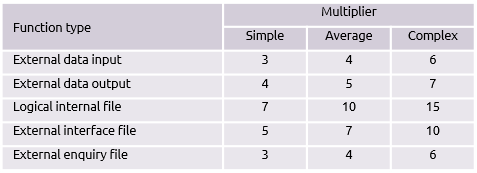

# CHAPTER #03: SOFTWARE DESIGN

---

## Basic Concept of Software Design

**Design**
In software design phase input is SRS document and output is SDD. Software designing is most creative process, where we actually decide how a problem will be solved.

**Characteristics of a Good SDD**

- The SDD must contain all the requirement which were given in SRS.
- The design document must be readable, easy to understand and maintainable.
- It must describe a complete picture of data, functional and behavioural domain.

**Steps of Design**
Software Designing in 3-step process:

1. Interface Design
2. Architectual Design
3. Details Design

### Interface Design

- In this, we treat system as a whole and understand the relationship between the system & environment.
- Here we treat system as a black box and do not concentrate how a function will be implemented but we decide what is input & what should be the output according to user requirement or SRS. **(Like a `black box testing:` "Are we building the right product?")**
  

### Architectural design

- In this we understand what are the major modules that must be implemented in the system and what are their responsibility and how they will communicate with each other.
- We do not give stress on individual modules but concentrate coupling and cohesion between the modules. Here we treat modules as black box.


### Detailed design/Low level design

- In this, specification of internal elements of all modules their functions, their processing methods, data structure, algorithms, everything is defined properly.


### Modularity

In modular architecture, we understand that a system is composed of well defined conceptually simple and independent units interacting through a well-defined interface.

**Advantage of having modular architecture**

- Easy to understand and explain.
- It is easy to design and document.
- It is easy to code and test.
- It is easy to maintain.

### Design Structure Charts

Structure Chart represent hierarchical structure of modules. It breaks down the entire system into lowest functional modules, describe functions and sub-functions of each module of a system to a greater detail.
Structure Chart partitions the system into black boxes (functionality of the system is known to the users but inner details are unknown). Inputs are given to the black boxes and appropriate outputs are generated.

**Symbols used in construction of structured chart**

- **`Module:`** It represents the process or task of the system. It is of three types.
  - `Control Module:` A control module branches to more than one sub module.
  - `Sub Module:` Sub Module is a module which is the part (Child) of another module.
  - `Library Module:` Library Module are reusable and invokable from any module.
- **`Condition Call:`** It represents that control module can select any of the sub module the basis of some condition.
- **`Loop (Repetitive call of module):`** It represents the repetitive execution of module by the sub module. A curved arrow represents loop in the module. All the sub modules cover by the loop repeat execution of module.
- **`Data Flow:`** It represents the flow of data between the modules. It is represented by directed arrow with empty circle at the end.
- **`Control Flow:`** It represents the flow of control between the modules. It is represented by directed arrow with filled circle at the end.
- **`Physical Storage:`** Physical storage is that where all the information are to be stored. It is represented by rectangle that have curve edges.

**Benefits of Design Structure Charts in Software Engineering**

- Improved understanding of system architecture
- Simplified communication between team members
- Easier identification of potential issues and dependencies
- Support for modular and maintainable software design

### Pseudocode

Pseudocode is a simplified, informal representation of an algorithm or a program that uses a mix of natural language and programming constructs.
It is used to illustrate the high-level structure and logic of an algorithm without the syntactic details of a specific programming language.
Pseudocode helps developers plan and discuss algorithms, making it easier to understand and translate into actual code later in the software development process.

```
BEGIN
    DISPLAY "Enter first number: "
    READ number1
    DISPLAY "Enter second number: "
    READ number2
    sum ← number1 + number2
    DISPLAY "The sum is: ", sum
END
```

### Coupling and cohesion

Coupling and cohesion are two parameters on which we can understand the quality of modularity in the design of a software
**Coupling:**
The measure of interdependence of one module over another module

  

**Types of Coupling**
**1. Content Coupling (Worst)**

- One module directly modifies another module’s data or logic.
- `Example:` A function directly accessing another function’s variables.
  **2. Common Coupling**
- Multiple modules share global data.
- `Example:` Many functions using the same global variable.
  **3. External Coupling**
- Modules rely on external systems or shared resources.
- `Example:` Using external files, databases, or APIs in a tightly coupled manner.
  **4. Control Coupling**
- One module controls another’s behavior by passing control variables.
- `Example:` Passing a flag to a function that dictates what it should do.
  **5. Stamp Coupling**
- Modules share a data structure but do not need all of it.
- `Example:` Passing an entire object when only some fields are required.
  **6. Data Coupling (Best)**
- Modules share only the necessary data.
- `Example:` A function receives only the required parameters.

- **Lower coupling (Data Coupling) is ideal** because it makes the system more modular, flexible, and maintainable.
- **Higher coupling (Content Coupling) should be avoided** as it increases dependency and reduces reusability.

**Types of Cohesion**
**1. Coincidental Cohesion (Lowest - Worst)**

- Unrelated tasks are grouped into a single module.
- `Example:` A utility function that handles logging, file operations, and string manipulation in one place.

**2. Logical Cohesion**

- Similar types of operations are grouped but are not necessarily related in function.
- `Example:` A single module handling multiple input formats like JSON, XML, and CSV.

**3. Temporal Cohesion**

- Functions that execute at the same time are grouped together.
- `Example:` Initialization tasks such as opening files, creating database connections, and setting environment variables.

**4. Procedural Cohesion**

- Functions are grouped based on a sequence of execution.
- `Example:` A module that processes a payment by verifying details, deducting balance, and generating a receipt.

**5. Communicational Cohesion**

- Functions operate on the same data and contribute to a single task.
- `Example:` A module that retrieves student data, processes it, and generates a report.

**6. Sequential Cohesion**

- The output of one function is the input to another function within the module.
- `Example:` A data processing module that first normalizes data, then filters it, and finally stores it.

**7. Functional Cohesion (Highest - Best)**

- A module performs a single well-defined task.
- `Example:` A function that only calculates the area of a circle based on input radius.

- **Higher cohesion (Functional Cohesion) is ideal** as it improves maintainability, readability, and reusability.
- **Lower cohesion (Coincidental Cohesion) should be avoided** as it leads to complex and unmanageable code.

## Design Approach

There are two popular apporach using which design is done


**1. Top-Down Approach**  
The **Top-Down Approach** starts with a **high-level design** and breaks it down into smaller, detailed components. It follows a hierarchical structure, where the main system is divided into submodules.

**Process:**

1. Define the overall system structure.
2. Break the system into smaller submodules.
3. Design each submodule in detail.
4. Implement and integrate the submodules.

**Advantages:**

- Provides a clear and organized system structure.
- Easy to understand and manage at the initial stages.
- Helps in early identification of design flaws.
- Ensures consistency across modules.

**Disadvantages:**

- Requires detailed planning before implementation.
- Difficult to test as submodules are not functional independently.
- Can be rigid and may require significant changes if issues arise later.

**2. Bottom-Up Approach**  
The **Bottom-Up Approach** starts with designing and implementing **small, reusable components**, which are later integrated to form the complete system.

**Process:**

1. Develop individual components first.
2. Test and refine the components independently.
3. Combine the components to form larger modules.
4. Integrate modules to create the complete system.

**Advantages:**

- Reusable components enhance modularity and flexibility.
- Easier to test as each component is functional independently.
- Faster development as small modules can be built and tested in parallel.
- Adaptable to changes without affecting the entire system.

**Disadvantages:**

- Lacks a clear high-level system design in the early stages.
- Integration can be complex and time-consuming.
- May lead to inconsistencies in the system if not properly planned.

**Key Differences:**

| Feature               | Top-Down Approach                           | Bottom-Up Approach                       |
| --------------------- | ------------------------------------------- | ---------------------------------------- |
| **Development Focus** | System as a whole                           | Individual components                    |
| **Implementation**    | Starts from main system                     | Starts from smaller components           |
| **Testing**           | Done after all submodules are developed     | Done at individual module level          |
| **Flexibility**       | Less flexible                               | More flexible                            |
| **Best Suited For**   | Large systems requiring high-level planning | Modular systems with reusable components |


- The **Top-Down Approach** is best for **structured, large-scale projects** where high-level planning is crucial.
- The **Bottom-Up Approach** is ideal for **modular and flexible designs**, especially in **object-oriented programming (OOP)**.

## Estimation Model

Here we try to estimate about two things time and cost of development

- Majorly estimation can be divided into four types:

  - Post estimation
  - Base estimation
  - Decomposition
  - Empirical model

- `Post/Delayed estimation:` In case of a friendly partly and known technology, we do not estimate either the time or the cost, because we know that cost will support as in every situation.
- `Base estimation:` In base estimation we predict the cost and time of the entire project based on the experience which we have gained from the previous projects.
- `Decomposition based estimation:` It is used for large projects where decomposition of the problem into smaller problems is done, usually it is done on two bases.
  - `Direct Estimation (White Box):` Size oriented metrices (KLOC).
  - `Indirect Estimation(Black Box):` Function oriented metrices (FP).

### - ``Effort = Size / Productivity`

### - `Productivity = Size / Effort`

### - `Size = Effort X Productivity`

### - `Cost Effort X Pay`

### - `Duration = Effort / Team Size`

### - `Team Size = Effort / Duration`

### - `Effort = Duration X Team Size`

## Direct Estimation (White Box)

## Problem 1: Estimating Effort, Cost, and Duration for a Full-Stack Application

A company is developing a full-stack web application with an estimated **size of 100 KLOC (Kilo Lines of Code)**.  
Based on previous projects, their **productivity is 2 KLOC per person-month**.  
The average **developer salary is $5000 per month**.  
The **team size** is **5 developers**.

### **Find:**

1. **Effort required**
2. **Cost of development**
3. **Duration of the project**

### **Solution:**

#### **1. Effort Calculation**

$$
\[
\text{Effort} = \frac{\text{Size}}{\text{Productivity}}
\]
\[
= \frac{100}{2} = 50 \text{ person-months}
\]
$$

#### **2. Cost Calculation**

$$
\[
\text{Cost} = \text{Effort} \times \text{Pay per person-month}
\]
\[
= 50 \times 5000 = 250,000 \text{ USD}
\]
$$

#### **3. Duration Calculation**

$$
\[
\text{Duration} = \frac{\text{Effort}}{\text{Team Size}}
\]
\[
= \frac{50}{5} = 10 \text{ months}
\]
$$

---

## Problem 2: Estimating Team Size for a New Project

A startup wants to develop a new full-stack SaaS platform with an estimated size of **200 KLOC**.  
The **project deadline is 12 months**.  
The **team's productivity is 4 KLOC per person-month**.

### **Find:**

1. **Effort required**
2. **Minimum team size needed**

### **Solution:**

#### **1. Effort Calculation**

$$
\[
\text{Effort} = \frac{\text{Size}}{\text{Productivity}}
\]
\[
= \frac{200}{4} = 50 \text{ person-months}
\]
$$

#### **2. Team Size Calculation**

$$
\[
\text{Team Size} = \frac{\text{Effort}}{\text{Duration}}
\]
\[
= \frac{50}{12} \approx 4.17
\]
$$

Since team size must be a whole number, they need at least **5 developers**.

---

## Problem 3: Productivity Calculation for an Ongoing Project

A company is working on a complex enterprise web application.  
They have already spent **60 person-months** with a **team of 6 developers** over **10 months**.  
The estimated **code size is 150 KLOC**.

### **Find:**

1. **Current productivity**
2. **Expected total effort at this rate**

### **Solution:**

#### **1. Productivity Calculation**

$$
\[
\text{Productivity} = \frac{\text{Size}}{\text{Effort}}
\]
\[
= \frac{150}{60} = 2.5 \text{ KLOC per person-month}
\]
$$

#### **2. Expected Total Effort**

If they continue at **2.5 KLOC per person-month**, the total effort required will be:

$$
\[
\text{Effort} = \frac{\text{Size}}{\text{Productivity}}
\]
\[
= \frac{150}{2.5} = 60 \text{ person-months}
\]
$$

Since they have already completed **60 person-months**, they are right on track to complete the project at the expected effort.

---

A company is developing a new **E-commerce platform**. Based on past projects, they estimate:

- **Optimistic Estimate (O):** The project could be completed in **4 months** if everything goes smoothly.
- **Most Likely Estimate (M):** The project will likely take **6 months** based on realistic conditions.
- **Pessimistic Estimate (P):** If delays occur, the project may take up to **10 months**.

### **Find:**

Estimate the expected project duration using the **PERT formula**:

$$
\[
E = \frac{O + 4M + P}{6}
\]
$$

---

### **Solution:**

Substituting values:

$$
\[
E = \frac{4 + 4(6) + 10}{6}
\]
$$

$$
\[
= \frac{4 + 24 + 10}{6}
\]
$$

$$
\[
= \frac{38}{6} \approx 6.33 \text{ months}
\]
$$

Thus, the expected project duration is **6.33 months (~6 months and 10 days).**

---

### **Conclusion:**

- **Optimistic (O)**: 4 months → Best case (everything goes perfectly).
- **Most Likely (M)**: 6 months → Normal expected timeline.
- **Pessimistic (P)**: 10 months → Worst case (delays, issues).
- **Estimated Duration (E)**: ~6.33 months based on PERT.

---

## InDirect Estimation (Black Box)

- Here we use functional points to predict the cost of development, it is a better technique in general compare to kloc because it considers the logical complexity of the product, as in general it is not necessary that the larger the project the more complex it will be code.
- (size oriented, function oriented, extended functions point matrices) here we say that the size of the software is directly dependent on the number and type of different functions it performs.
- 2D- in 2D FP we consider only information domain where we consider mainly five factors, as follows:
  - `No of inputs:` Each user data input is counted.
  - `No of outputs:` Output refers to reports, screen and error messages.
  - `No of inquiries:` The no of distinct interactive queries made by user which requires specific actions by the system.
  - `No of files:` Each logical file. So either can be data structure or physical files.
  - `No of external interfaces:` Data files on tapes, disk etc. and other interfaces that are used to transmit information to other systems are counted.

**Function Point Calculation**



## Indirect Estimation (Black Box)
# 2D Function Points
### **Indirect Estimation Using Function Point (FP) Approach**

**Scenario:**  
A **Full-Stack Web Application** is being developed. We estimate the **Function Points (FP)** based on project complexity.

#### **Given Data:**

- **Function Points (FP) = 500**
- **Productivity = 10 FP/person-month** (based on past experience)
- **Team Size = 3 developers**
  - 1 **Most Likely (M)**
  - 2 **Pessimistic (P)**

---

### **Step 1: Calculate Effort**

Using the formula:

$$
\[
\text{Effort} = \frac{\text{Size (FP)}}{\text{Productivity}}
\]
$$

$$
\[
\text{Effort} = \frac{500}{10} = 50 \text{ person-months}
\]
$$

---

### **Step 2: Calculate Duration**

Using the formula:

$$
\[
\text{Duration} = \frac{\text{Effort}}{\text{Team Size}}
\]
$$

$$
\[
\text{Duration} = \frac{50}{3} \approx 16.67 \text{ months}
\]
$$

So, the project will take **~16.67 months (~1 year and 4.5 months).**

---

### **Step 3: Calculate Productivity**

$$
\[
\text{Productivity} = \frac{\text{Size}}{\text{Effort}}
\]
$$

$$
\[
\text{Productivity} = \frac{500}{50} = 10 \text{ FP/person-month}
\]
$$

---

### **Final Results:**

| Metric           | Formula                                                 | Value              |
|-----------------|---------------------------------------------------------|--------------------|
| **Effort**       | `Size (FP) / Productivity = 500 / 10`                   | 50 person-months   |
| **Duration**     | `Effort / Team Size = 50 / 3`                           | ~16.67 months      |
| **Productivity** | `Size (FP) / Effort = 500 / 50`                         | 10 FP/person-month |

---

- The project **requires 50 person-months of effort**.
- With a **team of 3 developers**, the **expected duration is ~16.67 months**.
- The team maintains a **productivity rate of 10 FP/person-month**.
# Adjustable vs. Unadjustable in Indirect Estimation (Function Point Method)

In **Indirect Estimation (Function Point Method)**, software size is estimated based on function points (FP) rather than direct lines of code (LOC). The estimation can be categorized as **Adjustable** and **Unadjustable** based on whether external factors influence the calculation.

## 1. Adjustable Estimation

### Definition
An **adjustable estimation** allows modification of effort, duration, or cost based on external complexity factors, such as team experience, project complexity, or technology used.

### Key Features
- Uses **complexity adjustment factors (CAF)** or **value adjustment factors (VAF)**.
- The final function point is **adjusted** based on environmental and technical factors.
- Provides a **more realistic** estimation for software development.

### Formula

\[
\text{Adjusted Function Points} = \text{Unadjusted Function Points} \times \text{Value Adjustment Factor (VAF)}
\]

where **VAF** is calculated based on 14 general system characteristics (GSCs) such as reliability, performance, and reusability.

### Example
If a project has **500 unadjusted function points** and a **VAF of 1.2**, then:

$$
\[
\text{Adjusted FP} = 500 \times 1.2 = 600
\]
$$

## 2. Unadjustable Estimation

### Definition
**Unadjustable estimation** considers only the **raw function points** without any modifications for complexity or external factors.

### Key Features
- Uses **only function points without adjustments**.
- Does not consider external influences like **team skills or technical challenges**.
- Works well for **basic estimations** but may not be **accurate for complex projects**.

### Formula

$$
\[
\text{Unadjusted Function Points} = \text{Sum of all function points}
\]
$$

### Example
If a project has the following components:

- **Inputs:** 10 FP
- **Outputs:** 15 FP
- **User Queries:** 5 FP
- **Files:** 20 FP
- **Interfaces:** 10 FP

Total **Unadjusted FP** = **10 + 15 + 5 + 20 + 10 = 60 FP**

## Comparison Table

| Feature                  | Adjustable Estimation                    | Unadjustable Estimation  |
|--------------------------|------------------------------------------|--------------------------|
| Uses Complexity Factors? | Yes                                      | No                       |
| More Realistic?          | Yes                                      | No                       |
| Formula                  | `Unadjusted FP × VAF`                   | `Sum of all function points` |
| Example Calculation      | `500 × 1.2 = 600 FP`                     | `10 + 15 + 5 + 20 + 10 = 60 FP` |
| Best for Simple Projects?| No                                       | Yes                      |
| Best for Complex Projects?| Yes                                     | No                       |


## Conclusion

- **Use Adjustable Estimation** when a **realistic** prediction considering external complexities is required.
- **Use Unadjustable Estimation** for **quick and simple calculations** without external influences.


# 3D Function Points

## Introduction  
**3D Function Points** extend traditional function point analysis by incorporating three key dimensions:  
1. **Functional Size** – Measures the amount of functionality delivered to the user.  
2. **Technical Complexity** – Evaluates the technical effort required for implementation.  
3. **Quality Requirements** – Assesses the non-functional aspects, such as performance and security.  

## Key Concepts  
- Unlike traditional function points, which focus only on functional size, 3D Function Points provide a more **holistic estimation**.  
- It helps in better project **costing, planning, and risk assessment**.  
- It aligns closely with **Agile and modern software development methodologies**.  

## Calculation Approach  
1. **Determine the functional size** using function point counting rules.  
2. **Assess technical complexity** based on factors such as integration, security, and platform dependencies.  
3. **Evaluate quality requirements** including maintainability, scalability, and reliability.  

## Benefits  
- More **accurate** estimation compared to traditional function points.  
- **Better risk management** by considering technical and quality aspects.  
- Improved **alignment with real-world software development challenges**.  

## Conclusion  
3D Function Points enhance software estimation by considering multiple dimensions, making them more effective for complex and large-scale projects.  
