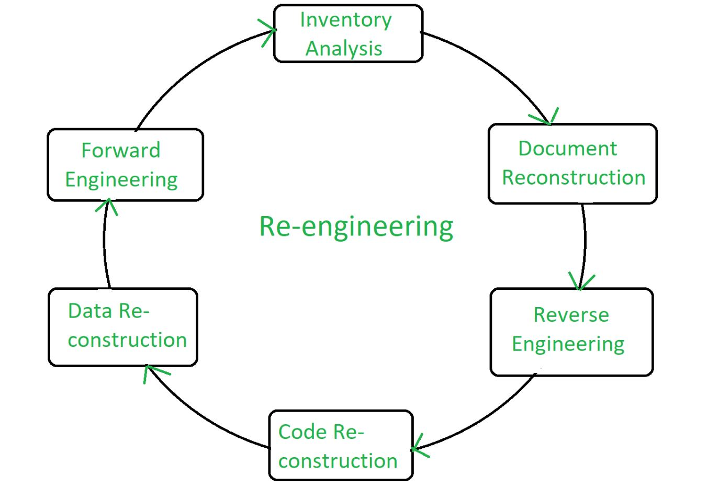
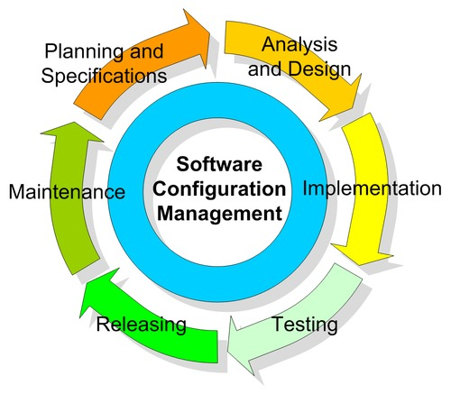
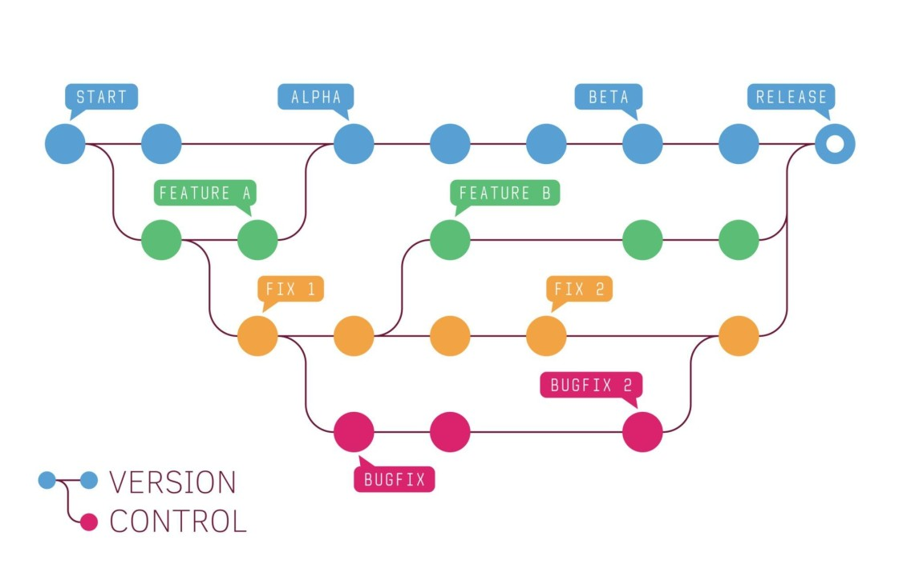
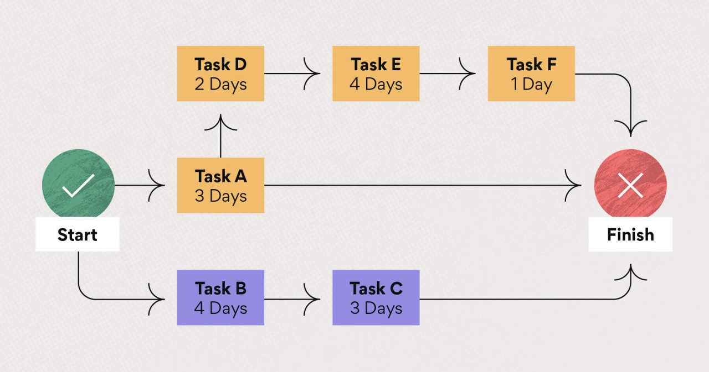
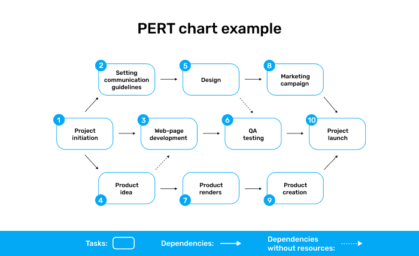
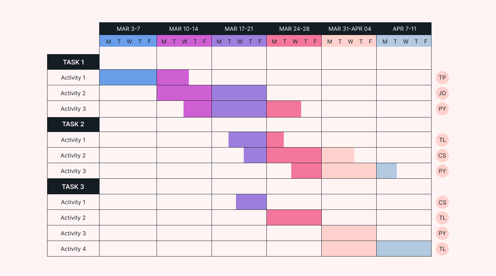
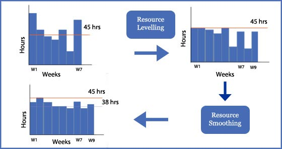
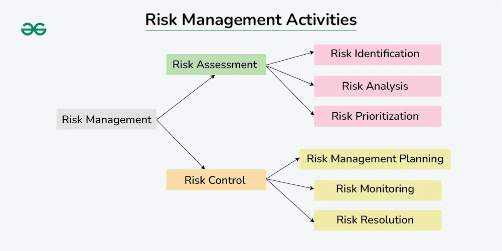

# CHAPTER #05: SOFTWARE TESTING

---
## Why Software Maintenance
- Always Changing: Software keeps changing to work better for people who use it. This is like how animals and plants change to survive in the world.
- Getting More Complex: Software used to be simple, but now it can do many things and connects people all over the world. This is like how nature has many different animals and plants living together.
- Survival of the Fittest: Good software will keep being used, while bad software will go away. This is like how strong animals and plants in nature can live longer and make more babies.

## Categories of Software Maintenance
- Maintenance can be divided into the following:
- `Corrective maintenance:` Corrective maintenance of a software product may be essential either to rectify some bugs observed while the system is in use, or to enhance the performance of the system.
- `Adaptive maintenance:` This includes modifications and updation when the customers need the product to run on new platforms, on new operating systems, or when they need the product to interface with new hardware and software.
- `Perfective maintenance:` A software product needs maintenance to support the new features that the users want or to change different types of functionalities of the system according to the customer demands.
- The key software maintenance issues are both managerial and technical. e.g. alignment with customer priorities, staffing, which organization does maintenance, estimating costs.
- `Key technical issues are:` limited understanding, impact analysis, testing, maintainability measurement.

## Software Re-Engineering
- Software re-engineering is the process of examining and modifying an existing software system to improve its functionality, performance, or adaptability without changing its core function.
- It's often undertaken to restructure a legacy system to enhance understandability, maintainability, and to upgrade to newer technologies or software practices.

## Software Re-Engineering Activities
- `Reverse Engineering:` This is the process of deconstructing a system to understand its components and their relationships, often to create documentation for a system where none exists or is out of date.
- `Restructuring:` This involves transforming the existing source code into a more maintainable form, often while preserving its functionality. This can include activities such as code refactoring, where the code is reorganized to be more understandable or efficient.
- `Forward Engineering:` After understanding and possibly restructuring the system, changes are made to the system to improve it or adapt it to new requirements or technologies. This can include implementing new features, improving performance, or changing the system to use a new technology stack.
- `Re-documentation:` This involves updating or creating new documentation for the system. This can be especially important if the original documentation was lost, out of date, or if the system has been significantly changed during the re- engineering process.

### Benefits of Software Re-Engineering Phases  

1. **Reverse Engineering** – Helps in understanding legacy systems, improving documentation, and identifying areas for enhancement.  
2. **Restructuring** – Improves code readability, maintainability, and performance without changing its functionality.  
3. **Forward Engineering** – Enhances system functionality, modernizes technology, and optimizes performance.  
4. **Data Re-Engineering** – Improves data integrity, consistency, and accessibility, ensuring better system efficiency.  
5. **Migration & Integration** – Enables smooth transition to modern platforms, enhancing scalability and interoperability.  

## Software Reverse Engineering
Software Reverse Engineering is the process of recovering the design and the requirements specification of a product from an analysis of it's code. Reverse Engineering is becoming important, since several existing software products, lack proper documentation, are highly unstructured, or their structure has degraded through a series of maintenance efforts.

### Steps of Software Reverse Engineering
1. Collecting Information
2. Examining the Information 
3. Extracting the Structure 
4. Recording the Functionality 
5. Recording Data Flow 
6. Recording Control Flow 
7. Review extracted Design 
8. Generate Documentation

### Why Reverse Engineering?
1. Providing proper system documentation. 
2. Recovery of lost information.
3. Assisting with maintenance. 
4. Facility of software reuse.
5. Discovering unexpected flaws or faults.

## Software Configuration Management Activities
- The primary reasons for Implementing Software Configuration Management System are: 
    - There are multiple people working on software which is continually updating.
    - It may be a case where multiple version, branches, authors are involved in a software
    - project, and the team is geographically distributed and works concurrently.
    - Changes in user requirement, policy, budget, schedule need to be accommodated. 
    - Software should able to run on various machines and Operating Systems.
    - Helps to develop coordination among stakeholders.
    - SCM process is also beneficial to control the costs involved in making changes to a system.

### Software Configuration Management
- Can be defined as a process of defining and implementing a standard configuration, which results into the primary benefits such as easier setup and maintenance, less down-time better integration with enterprise management, and more efficient and reliable backups and also maximize productivity by minimizing mistakes.
- SCM is used to track and manage the emerging product and its versions.
- SCM ensures that all people involved in the software process know what is being designed, developed, built, tested and delivered.
- Through SCM, the design requirements can be traced to the final software product.

### Objectives Software Configuration Management
- Remote system administration
- Reduced user down-time
- Reliable data backups
- Easy workstation setup
- Multi-User support

### Tasks in SCM process
- **Configuration Identification:**
    - Configuration identification is a method of determining the scope of the software system.
    - With the help of this step, you can manage or control something even if you don't know what it is.
- **Baseline:**
    - A baseline is a formally accepted version of a software configuration item.
    - It is designated and fixed at a specific time while conducting the SCM process. It can only be changed through formal change control procedures.
- **Change Control:**
    - Change control is a procedural method which ensures quality and consistency when changes are made in the configuration object.
    - In this step, the change request is submitted to software configuration manager.
- **Configuration Status Accounting:**
    - Configuration status accounting tracks each release during the SCM process. This stage involves tracking what each version has and the changes that lead to this version.
- **Configuration Audits and Reviews:**
    - Software Configuration audits verify that all the software product satisfies the baseline needs.
    - It ensures that what is built is what is delivered.

## Software version control
Version control is a way to keep track of changes in computer programs. It helps people work together on a project without causing problems. They can see what changes were made, when, and by whom. It also lets them go back to an older version if something goes wrong.

- `Identifying New Versions:` Each time changes are made and saved, the version control system creates a new, unique version of the software. This helps developers track the software's evolution and easily manage multiple versions.
- `Numbering Scheme:` Version control systems assign a specific numbering or naming scheme Oto each version (e.g., 1.0, 1.1, 1.2, or 2.0). This helps developers and users identify the software's progression and understand the scope of changes between versions.
- `Visibility:` Version control makes the entire history of the software project visible to all team members. This enhances collaboration and helps developers understand the context and impact of past changes on the current codebase.
- `Tracking:` Version control systems keep detailed records of who made each change, when it was made, and the specific modifications. This level of tracking helps maintain accountability and facilitates communication among team members.

## Resource Allocation Models
- Resource allocation models in software engineering refer to strategies or methods used to distribute various types of resources effectively across different aspects of a software project. These resources could include things like personnel, time, budget, computing resources, etc.
- These models help project managers in decision-making processes to ensure the efficient use of resources, meet project deadlines, maintain the quality of the software product, and stay within the budget.

- `Critical Path Method (CPM):` This is a step-by-step technique used in project management for scheduling project activities. It identifies critical and non- critical tasks to prevent conflicts and bottlenecks.

- `Program Evaluation and Review Technique (PERT):` This is a statistical tool used in project management, designed to analyze and represent the tasks involved in completing a given project. It helps to estimate the minimum time needed to complete the project.

- `Gantt Chart:` It's a type of bar chart that illustrates a project schedule. This chart lists the tasks to be performed on the vertical axis, and time intervals on the horizontal axis.

- `Resource Leveling:` Also known as resource smoothing, it's a technique in project management that involves adjusting the project schedule to balance the demand for project resources with the available supply.

- `Allocation Models in Agile Methodology:` In agile teams, resources might be allocated based on different factors such as team velocity, priority of user stories, and size of tasks.

## Software Risk Analysis and Management
Risk management is the process of identifying risk, assessing risk hat could negatively impact a software project's success and taking steps to reduce this to acceptable level.

Here are the key components:
- `Risk Identification:` This is the initial process of determining risks that could potentially prevent the program, enterprise, or investment from achieving its objectives. It includes documenting and communicating the concern.
- `Risk Analysis:` Once risks are identified, they are analyzed to identify the qualities of the risk such as its likelihood of occurrence, severity of impact, what precipitates the risk, and other characteristics. This can be done quantitatively or qualitatively.
- `Risk Assessment/Evaluation:` This involves comparing the identified and analyzed risk against predefined criteria such as acceptable risk levels and priorities. It's used to make decisions about the impact of the risk and whether it's acceptable or if it needs to be treated.
- `Risk Mitigation:` This is the process of prioritizing, evaluating, and implementing actions that reduce or control the risks. It can involve risk avoidance, risk transfer, risk acceptance, or risk limitation.
- `Risk Monitoring:` This is the process of monitoring identified and mitigated risks, as well as identifying new risks. This is an ongoing process throughout the lifecycle of the project.

- In a nutshell, Software Risk Analysis and Management aims to anticipate what might not go as planned and prepare a response to those scenarios, so that action can be taken to resolve risk events that do occur or to minimize their impact.